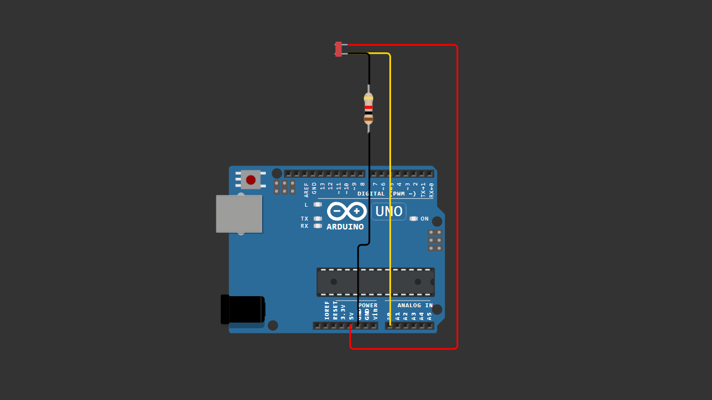

# Arduino LDR Light Sensor Test

This is a beginner Arduino project that demonstrates how to use an LDR (Light Dependent Resistor) to measure light intensity using analog input.

The analog value is displayed in the Serial Monitor.

---

## 📌 Features

- Reads light intensity using analog pin A0
- Uses voltage divider configuration
- Displays real-time values in Serial Monitor
- Beginner friendly project

---

## 🧰 Components Used

- Arduino Uno
- LDR (Light Dependent Resistor)
- 33K Ohm Resistor
- Breadboard
- Jumper Wires

---

## 🔌 Wiring Diagram

Voltage Divider Configuration:

5V → LDR → A0 → 33K Resistor → GND

The middle connection between the LDR and the resistor goes to analog pin A0.

> Make sure your wiring matches the diagram above before uploading the code.

---

## 💻 Arduino Code

You can download the Arduino sketch here:

[Download Arduino Code](Arduino_LDR_Light_Sensor_Test.ino)

Or open the `.ino` file directly inside this repository.

---

## 📥 How It Works

- Bright light → lower analog value
- Dark condition → higher analog value
- Arduino reads voltage from the voltage divider

---

## 🎥 YouTube Tutorial

Watch the full video tutorial here:

---

## 🚀 Next Project

In the next project, we will use this LDR to automatically control an LED.
